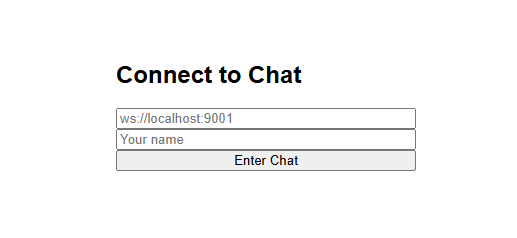

# Chat on Websockets
The project is a minimal representation of the implementation of a network chat based on websockets

## Demo



## Dependencies

- [uWebSockets](https://github.com/uNetworking/uWebSockets/)
- [json](https://github.com/nlohmann/json)

## Quick Start

```console
cmake -B build -S .
cmake --build build
./build/Debug/char_server.exe
```